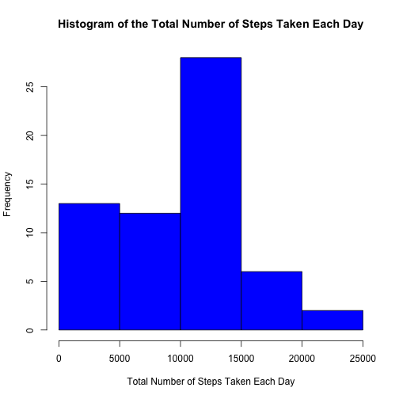
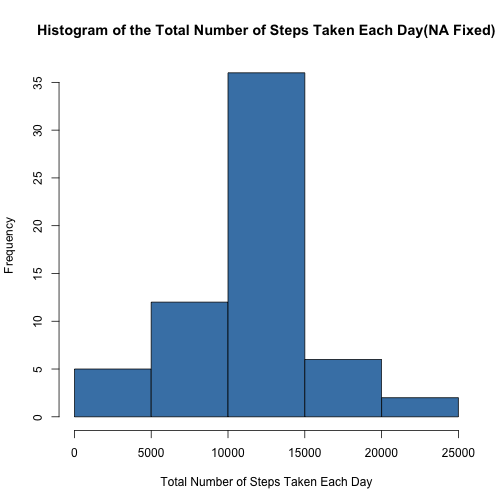
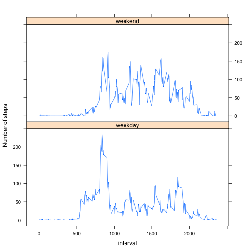

# Reproducible Research: Peer Assessment 1


## Loading and preprocessing the data
Read data in *.zip* format, and then convert it into a data table for program
efficiency.

```r
library(data.table)
file <- unz("activity.zip", "activity.csv")
data <- data.table(read.table(file, header = TRUE, sep = ",", na.string = "NA"))
summary(data)
```

```
##      steps               date          interval   
##  Min.   :  0.0   2012-10-01:  288   Min.   :   0  
##  1st Qu.:  0.0   2012-10-02:  288   1st Qu.: 589  
##  Median :  0.0   2012-10-03:  288   Median :1178  
##  Mean   : 37.4   2012-10-04:  288   Mean   :1178  
##  3rd Qu.: 12.0   2012-10-05:  288   3rd Qu.:1766  
##  Max.   :806.0   2012-10-06:  288   Max.   :2355  
##  NA's   :2304    (Other)   :15840
```

```r
class(data)
```

```
## [1] "data.table" "data.frame"
```


## What is mean total number of steps taken per day?

Calculate the sum of steps group by date, and store the result into *stepsum*.

Notice that the *NA* values are removed in the *sum* function, so if the data is
missing on a specific date, it will result in a *zero sum value*.

```r
stepsum <- data[, sum(steps, na.rm = TRUE), by = date]
setnames(stepsum, c("date", "stepsum"))
```


We can get the histogram of the total number of steps taken each day as follows.

```r
hist(stepsum$stepsum, xlab = "Total Number of Steps Taken Each Day", main = "Histogram of the Total Number of Steps Taken Each Day", 
    col = "blue")
```

 


**Mean**:

```r
mean(stepsum$stepsum, na.rm = TRUE)
```

```
## [1] 9354
```


**Median**:

```r
median(stepsum$stepsum, na.rm = TRUE)
```

```
## [1] 10395
```


## What is the average daily activity pattern?
The time series plot can be made by this:

```r
stepmean <- data[, mean(steps, na.rm = TRUE), by = interval]
setnames(stepmean, c("interval", "stepmean"))
plot(stepmean, type = "l", ylab = "Average Number of Steps Taken")
```

 

The interval that contains the maximum number of steps can be evaluated via:

```r
stepmean[sort(stepmean, decreasing = TRUE)][1, interval]
```

```
## [1] 1705
```


## Imputing missing values
The total number of missing values in the dataset is calculated by:

```r
data[, sum(is.na(steps))]
```

```
## [1] 2304
```

We are going to fill the NAs with the average steps taken within the interval,
which has been calculated and stored in *stepmean*.

First of all we will define a function for filling the NA steps.

```r
fillna <- function(steps, stepmean) {
    if (!is.na(steps)) {
        steps
    } else {
        stepmean
    }
}
```

Then we can use *mapply* function to toggle NAs in *steps*.

```r
data[, `:=`(stepsfixed, mapply(fillna, steps, stepmean$stepmean))]
```

```
##        steps       date interval stepsfixed
##     1:    NA 2012-10-01        0    1.71698
##     2:    NA 2012-10-01        5    0.33962
##     3:    NA 2012-10-01       10    0.13208
##     4:    NA 2012-10-01       15    0.15094
##     5:    NA 2012-10-01       20    0.07547
##    ---                                     
## 17564:    NA 2012-11-30     2335    4.69811
## 17565:    NA 2012-11-30     2340    3.30189
## 17566:    NA 2012-11-30     2345    0.64151
## 17567:    NA 2012-11-30     2350    0.22642
## 17568:    NA 2012-11-30     2355    1.07547
```

We can check number of NAs in *datafixed*.

```r
data[, sum(is.na(stepsfixed))]
```

```
## [1] 0
```

It works.

Now we are going to re-calculate the stepsum, and plot the new histogram, with
new **mean** and **median** calculated as well.

```r
stepsumfixed <- data[, sum(stepsfixed, na.rm = TRUE), by = date]
setnames(stepsumfixed, c("date", "stepsumfixed"))
hist(stepsumfixed$stepsumfixed, xlab = "Total Number of Steps Taken Each Day", 
    main = "Histogram of the Total Number of Steps Taken Each Day(NA Fixed)", 
    col = "steelblue")
```

 


**Mean**:

```r
mean(stepsumfixed$stepsumfixed, na.rm = TRUE)
```

```
## [1] 10766
```


**Median**:

```r
median(stepsumfixed$stepsumfixed, na.rm = TRUE)
```

```
## [1] 10766
```

As we can see, after imputing missing values, the mean and median are higher 
than what were calculated before.

## Are there differences in activity patterns between weekdays and weekends?
First we need to manipulate the data a little bit.

```r
transformweekday <- function(datestring) {
    if (weekdays(as.Date(datestring)) %in% c("Saturday", "Sunday")) {
        factor("weekend")
    } else {
        factor("weekday")
    }
}
data[, `:=`(day, sapply(date, transformweekday))]
```

```
##        steps       date interval stepsfixed     day
##     1:    NA 2012-10-01        0    1.71698 weekday
##     2:    NA 2012-10-01        5    0.33962 weekday
##     3:    NA 2012-10-01       10    0.13208 weekday
##     4:    NA 2012-10-01       15    0.15094 weekday
##     5:    NA 2012-10-01       20    0.07547 weekday
##    ---                                             
## 17564:    NA 2012-11-30     2335    4.69811 weekday
## 17565:    NA 2012-11-30     2340    3.30189 weekday
## 17566:    NA 2012-11-30     2345    0.64151 weekday
## 17567:    NA 2012-11-30     2350    0.22642 weekday
## 17568:    NA 2012-11-30     2355    1.07547 weekday
```

The step mean can be calculated by

```r
stepmeancategorical <- data[, mean(steps, na.rm = TRUE), by = c("interval", 
    "day")]
setnames(stepmeancategorical, c("interval", "day", "stepmean"))
```

Finally we get the following plot:

```r
library(lattice)
xyplot(stepmean ~ interval | day, data = stepmeancategorical, type = "l", layout = c(1, 
    2), ylab = "Number of steps")
```

 

